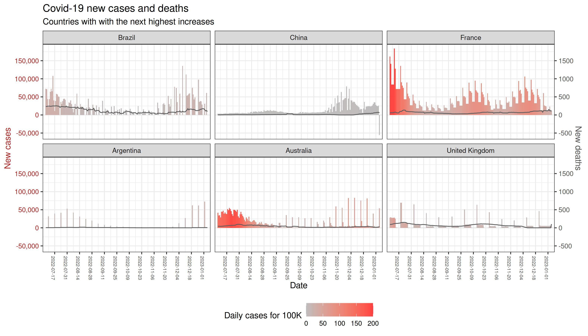
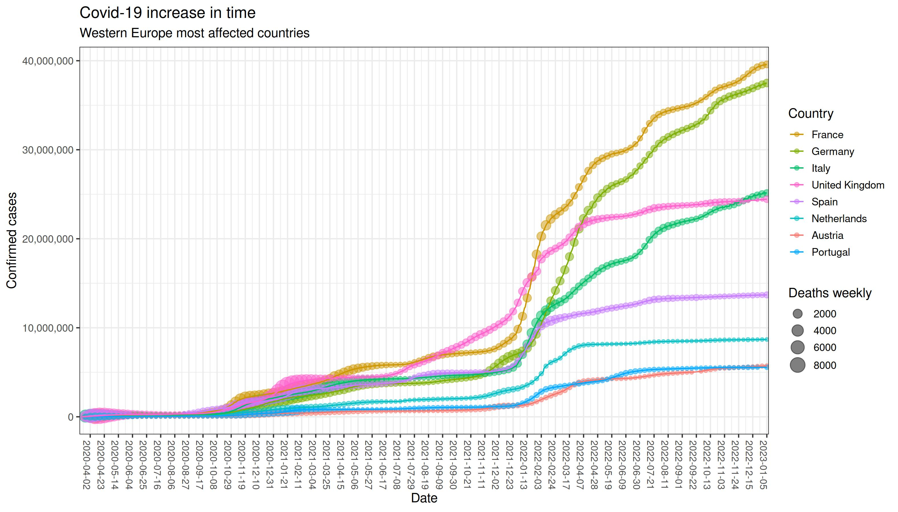
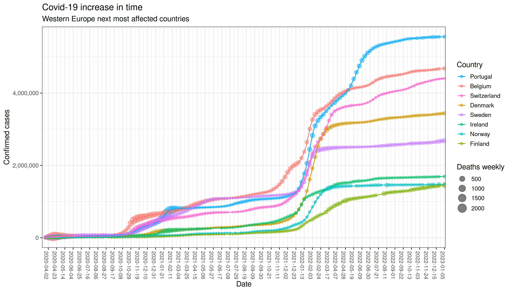
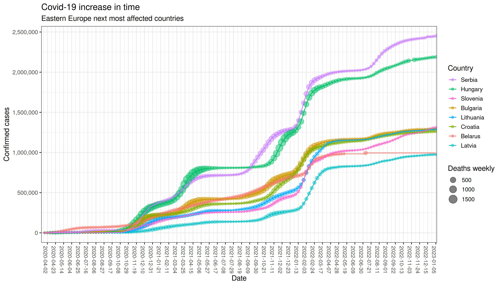
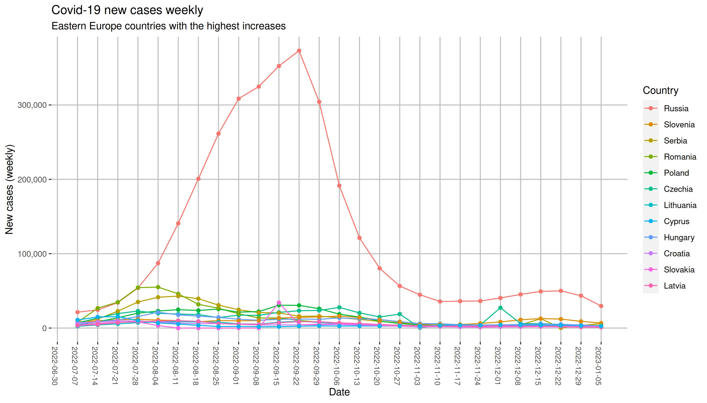
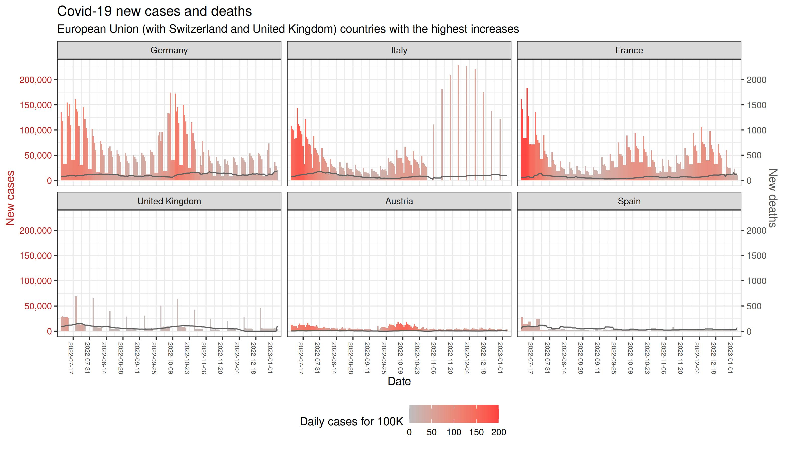
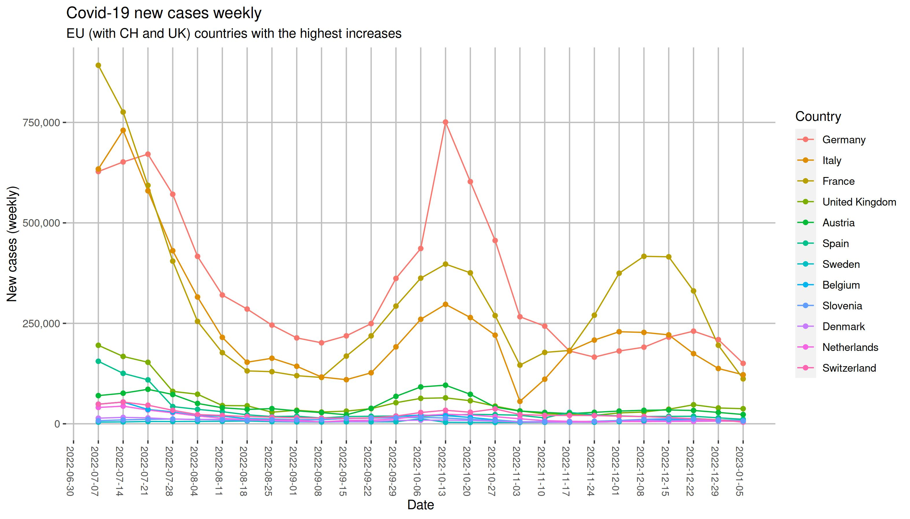
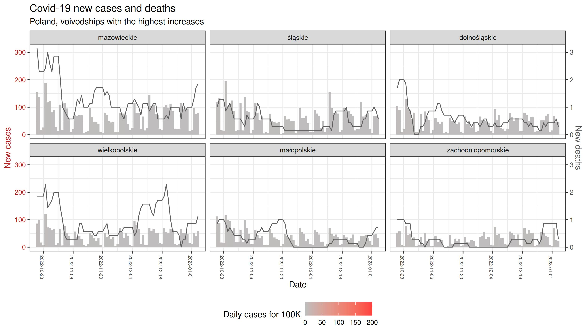
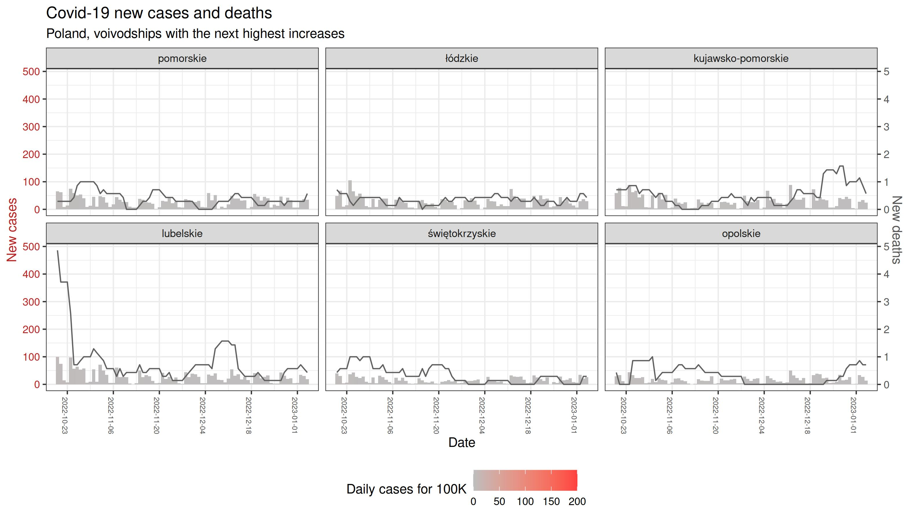

 

  <button class="tablinks" onclick="openPlot(event, 'big')" id="defaultOpen"> Most affected countries</button>
  <button class="tablinks" onclick="openPlot(event, 'ceu')" id="western"> Western Europe </button>
  <button class="tablinks" onclick="openPlot(event, 'eeu')" id="eastern"> Eastern Europe </button>
  <button class="tablinks" onclick="openPlot(event, 'eu')" id="union"> European Union </button>
  <button class="tablinks" onclick="openPlot(event, 'cont')" id="continents"> Continents </button>
  <button class="tablinks" onclick="openPlot(event, 'pol')" id="poland"> Poland </button>
  <button class="tablinks" onclick="openPlot(event, 'ch')" id="swiss"> Switzerland </button>
  <button class="tablinks" onclick="openPlot(event, 'other')" id="others"> Other Charts </button>

      
     
        
    
            
    
        
    
<embed src="./../corona/plots/C19_log_BIG.html" width="95%" height="800" /> 
 
        
    
        
    
        
    
        
    
      
    
 <a href="#" class="top"> Back to the top </a> &nbsp;&nbsp; 
                 <a href="#" class="top" onclick="document.getElementById('western').click()"> Next > </a> 

      
    
        
    
        
    
<embed src="./../corona/plots/C19_log_CEU.html" width="95%" height="880" /> 
 
        
    
        
    
        
    
        
    
      
    
 <a href="#" class="top" onclick="document.getElementById('defaultOpen').click()"> < Previous </a> &nbsp;&nbsp; 
                 <a href="#" class="top"> Back to the top </a> &nbsp;&nbsp; 
                 <a href="#" class="top" onclick="document.getElementById('eastern').click()"> Next > </a> 

      
    
        
    
        
    
<embed src="./../corona/plots/C19_log_EEU.html" width="95%" height="950" /> 
 
        
    
        
    
        
    
        
    
      
    
 <a href="#" class="top" onclick="document.getElementById('western').click()"> < Previous </a> &nbsp;&nbsp; 
                 <a href="#" class="top"> Back to the top </a> &nbsp;&nbsp; 
                 <a href="#" class="top" onclick="document.getElementById('union').click()"> Next > </a> 

      
    
        
    
        
    
        
    
<embed src="./../corona/plots/C19_log_EU.html" width="95%" height="1150" /> 
 
        
    
        
    
        
    
        
    
      
    
 <a href="#" class="top" onclick="document.getElementById('eastern').click()"> < Previous </a> &nbsp;&nbsp; 
                 <a href="#" class="top"> Back to the top </a> &nbsp;&nbsp; 
                 <a href="#" class="top" onclick="document.getElementById('continents').click()"> Next > </a> 

      
    
        
    
<embed src="./../corona/plots/C19_log_Cont.html" width="80%" height="650" /> 
 
        
    
        
    
      
    
 <a href="#" class="top" onclick="document.getElementById('union').click()"> < Previous </a> &nbsp;&nbsp; 
                 <a href="#" class="top"> Back to the top </a> &nbsp;&nbsp; 
                 <a href="#" class="top" onclick="document.getElementById('poland').click()"> Next > </a> 

      
    
        
    
        
    
        
    
        
    
        
    
 <!--<h2 style="color:darkblue"> Interactive chart with Polish voivodeships </h2>-->
             <embed src="./../corona/plots/C19_PL.html" width="80%" height="750" /> 
 
        
    
 <embed src="./../corona/plots/C19_log_Reg.html" width="80%" height="700" /> 
 
      
    
 <a href="#" class="top" onclick="document.getElementById('continents').click()"> < Previous </a> &nbsp;&nbsp; 
                 <a href="#" class="top"> Back to the top </a> &nbsp;&nbsp; 
                 <a href="#" class="top" onclick="document.getElementById('swiss').click()"> Next > </a> 

      
    
        
    
        
    
        
    
        
    
            
    
 <embed src="./../corona/plots/C19_log_CH-cant.html" width="80%" height="700" /> 
 
      
    
 <a href="#" class="top" onclick="document.getElementById('poland').click()"> < Previous </a> &nbsp;&nbsp; 
                 <a href="#" class="top"> Back to the top </a> &nbsp;&nbsp; 
                 <a href="#" class="top" onclick="document.getElementById('others').click()"> Next > </a> 

    
    
      
    
        
     
        
    
        
   <td>  </td>
        
    
 <embed src="./../corona/plots/C19_dots.html" width="95%" height="800" /> 
 
      
    
 <a href="#" class="top" onclick="document.getElementById('swiss').click()"> < Previous </a> &nbsp;&nbsp; 
                 <a href="#" class="top"> Back to the top </a> 

   
