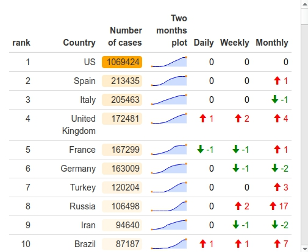
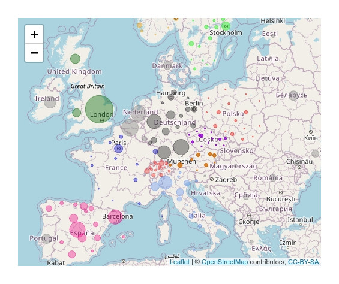

 
### Choose visualization type.
 
<table class="center fit">
  <tr>
    <td> 
      <abbr title="Plots of the virus developement"> <lli> <a href="plots">
      <big> Plots </big>    
      </a></lli> </abbr>
    </td>
    <td> 
      <abbr title="Ranking of infected countries"> <lli> <a href="tab">
      <big> Tables </big>    
      </a></lli> </abbr>
    </td>
    <td> 
      <abbr title="Map with the virus spread"> <lli> <a href="map">
      <big> Maps </big>    
      </a></lli> </abbr>
    </td>

  </tr>
</table>
 
Updated on
 
<embed src="corona/plots/time.txt">

